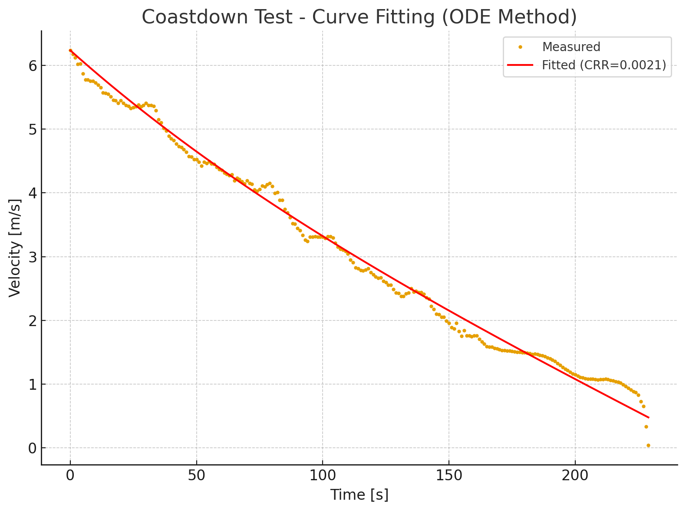

# Coastdown Test - ODE-Based Estimation of Rolling Resistance Coefficient (CRR)

## Overview
This repository documents an ODE-based method to estimate the **Coefficient of Rolling Resistance (CRR)** from a coastdown test.  
The approach uses numerical integration of the vehicle dynamics equation and optimizes CRR by minimizing the error between measured and simulated velocity.

---
## Testing Preparation
- Measure **total vehicle mass** (including driver)
- Set tire pressure to be tested (in this condition is 80 PSi)
- Kepp the transmission in constant variable (no gear change)
- Testing Track should be straight, flat road segment
- Low wind speed condition

## Data Collection
- Accelerate vehicle to a target speed (e.g. 25-30 km/h).
- Release throttle, allow the vehicle to coast down to < 0 km/h.
- Record **speed vs. time** at fixed intervals (e.g. 1hz).
- Repeat test at least 3 times in **Direction A** and **Direction B** (direction B is reversed of direction A) this performed to exclude effect of grade $$(\theta)$$ road.

## Mathematical Model

When a vehicle is coasting freely on a flat road:

$$
m \frac{dv}{dt} = -F_{rr} - F_{aero}
$$

- Rolling resistance:

$$
F_{rr} = C_{rr} \cdot m \cdot g
$$

- Aerodynamic drag:

$$
F_{aero} = \tfrac{1}{2} \rho A_f C_d v^2
$$

Thus, the ODE for velocity becomes:

$$
\frac{dv}{dt} = - C_{rr} g - \frac{\rho A_f C_d}{2m} v^2
$$

---

## Estimation Algorithm

1. **Input data**: measured time vs velocity(km/h) from a coastdown test.  

2. **Initial guess**: set an initial CRR value (e.g. 0.005).  

3. **Numerical integration**: simulate $$\( v(t) \)$$ by solving the ODE.  

Euler method (simplified):

$$
v_{i+1} = v_i + \Delta t \left( -C_{rr} g - k v_i^2 \right)
$$

with:

$$
k = \frac{0.5 \rho A_f C_d}{m}
$$

More accurately, Runge–Kutta (RK4) can be used via `scipy.odeint`.

4. **Error evaluation**: compare simulated velocity with measured velocity using **Sum of Squared Errors (SSE)**:

$$
SSE(C_{rr}) = \sum_{i=1}^N \left( v_{measured}(t_i) - v_{predicted}(t_i; C_{rr}) \right)^2
$$

5. **Optimization**: adjust $$\( C_{rr} \)$$ using numerical optimization (`scipy.optimize.minimize`) to minimize SSE.  

6. **Output**: best-fit $$\( C_{rr} \)$$ and simulated velocity profile.

## Example Output

Here is an example of the coastdown fitting result:

---

**The ODE-based result is smoother and more robust against noise, since it uses the full velocity profile rather than noisy acceleration data.**

---

